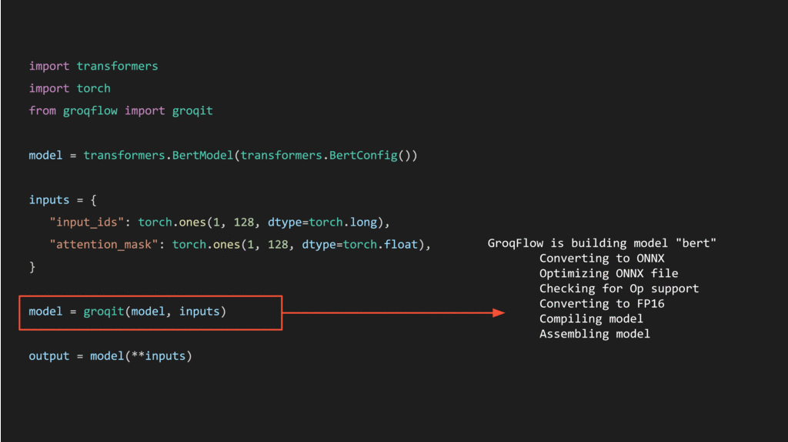

# GroqFlow 🚀

GroqFlow™ is the easiest way to get started with Groq's technology. GroqFlow provides an automated tool flow for compiling machine learning and linear algebra workloads into Groq programs and executing those programs on GroqChip™ processors.

We recommend that your system meets the following hardware requirements:

- To build models: 32GB or more of RAM.
- To run models: at least 1 GroqChip processor. For larger models, additional GroqChip processors may be required (1, 2, 4, and 8).

---

## Installation Guide

Sign-up on [support.groq.com](https://support.groq.com) to download and install GroqWare™ Suite version 0.9.0.

For installation instructions, please have a look at our [Install Guide](docs/install.md).

## Getting Started

To Groq a PyTorch model, simply provide your model and inputs to the `groqit()` function. Once `groqit()` has built your model, you can execute your Groq model the same way you execute a PyTorch model.

`groqit()` also works with ONNX files and provides many customization options. You can find more information about how to use groqit() in our [User Guide](docs/user_guide.md).

---

## Navigating GroqFlow

* [docs](docs/): All information you'd need to be successful with GroqFlow.

* [examples](examples/): Includes various GroqFlow examples.

* [groqflow](groqflow/): The source code for the `groqflow` package.

* readme.md

* setup.py
